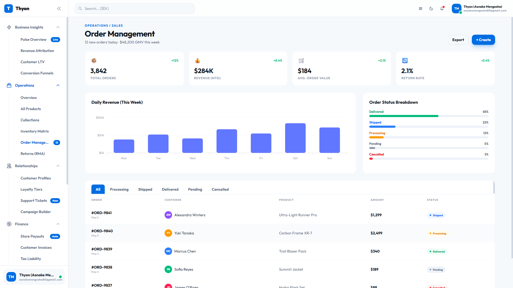
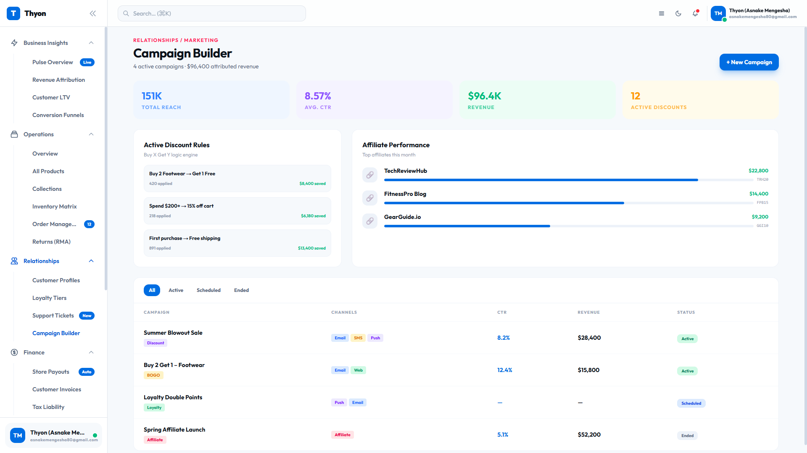
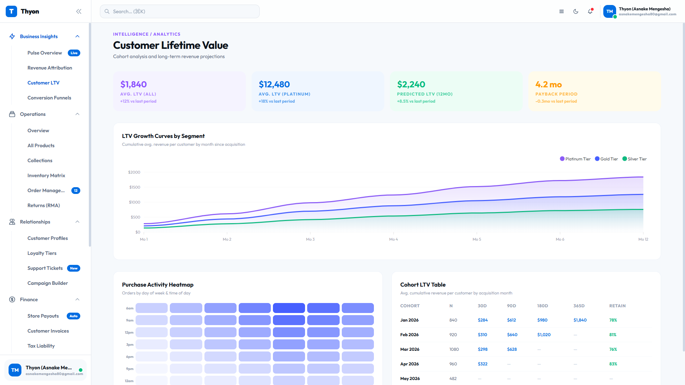

<div align="center">
  <h1>🚀 Thyon Admin Dashboard</h1>
  <p><strong>A sleek, high-performance, and scalable e-commerce administration panel built for the modern web.</strong></p>

  [](https://nextjs.org/)
  [](https://www.typescriptlang.org/)
  [](https://tailwindcss.com/)
  [](https://reactjs.org/)
</div>

<br />

## ✨ Overview

Thyon is an enterprise-grade admin dashboard tailored for e-commerce platforms. Designed with a focus on usability, aesthetics, and performance, it provides administrators with all the essential tools they need to manage their operations smoothly. From in-depth financial analytics to comprehensive order management and marketing campaign building, Thyon sets a new standard for backend management tools.

<br />

## 📸 Screenshots

### Order Management
Manage, track, and fulfill your orders efficiently with our advanced, filterable data tables.


### Campaign Builder
Design and deploy targeted marketing campaigns with an intuitive interface.


### Customer Income & Finance
Get real-time insights into revenue, tax liabilities, and customer analytics.


<br />

## 🎯 Key Features

- **📊 Comprehensive Analytics:** Real-time metrics for sales, revenue, and customer lifetime value.
- **📦 Advanced Order & Inventory Management:** Streamlined workflows for order fulfillment and stock tracking.
- **💳 Financial Control:** Dedicated modules for store payouts, customer invoices, and tax liability tracking.
- **🚚 Global Logistics:** Manage carrier networks, shipping zones, and global package tracking from one hub.
- **🎨 Custom Design System:** Built-in UI Kit with reusable, highly customizable components.
- **⚡ Developer First:** Extensive API integrations interface and webhook management tools.
- **🌓 Dark/Light Mode:** First-class support for both themes with vibrant accents and glass-morphism effects.

<br />

## 🛠️ Tech Stack

- **Framework:** [Next.js](https://nextjs.org/) (App Router, Turbopack)
- **Language:** [TypeScript](https://www.typescriptlang.org/)
- **Styling:** [Tailwind CSS](https://tailwindcss.com/)
- **Charts:** [ApexCharts](https://apexcharts.com/)
- **Icons:** Custom SVG integrations
- **Tooling:** ESLint, Prettier

<br />

## 🚀 Getting Started

### Prerequisites

Make sure you have Node.js (v18 or higher) and npm installed on your machine.

### Installation

1. **Clone the repository**
   ```bash
   git clone https://github.com/Thyon3/Admin-Dashboard.git
   cd Admin-Dashboard
   ```

2. **Install dependencies**
   ```bash
   npm install
   ```

3. **Run the development server**
   ```bash
   npm run dev
   ```

4. **Open your browser**
   Navigate to [http://localhost:3000](http://localhost:3000) to view the application.

<br />

## 🏗️ Project Structure

```text
src/
├── app/                  # Next.js App Router (Pages & Layouts)
│   ├── admin/            # Core dashboard routes (Finance, Logistics, Products, etc.)
│   └── globals.css       # Global styles and Tailwind directives
├── components/           # Reusable UI components
│   ├── form/             # Inputs, checkboxes, toggles
│   ├── layout/           # Sidebar, Header, wrappers
│   └── ui/               # Core design system (Buttons, Modals, Tables, etc.)
├── context/              # React Context providers (Theme, Notifications, etc.)
└── utils/                # Helper functions (Date formatting, data processing)
```

<br />

## 🤝 Contributing

Contributions are welcome! If you'd like to improve Thyon, please open an issue first to discuss what you would like to change. 

1. Fork the Project
2. Create your Feature Branch (`git checkout -b feature/AmazingFeature`)
3. Commit your Changes (`git commit -m 'Add some AmazingFeature'`)
4. Push to the Branch (`git push origin feature/AmazingFeature`)
5. Open a Pull Request

<br />

## 📄 License

This project is proprietary and confidential. Unauthorized copying, distribution, or modification is strictly prohibited.
